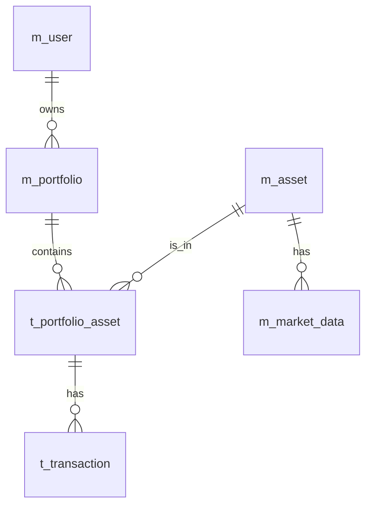

# InvestTrack Database Design

## 1. **m\_user（ユーザー）**

```sql
CREATE TABLE m_user (
  user_id SERIAL PRIMARY KEY,
  username VARCHAR(255) UNIQUE NOT NULL,
  email VARCHAR(255) UNIQUE NOT NULL,
  password VARCHAR(255) NOT NULL,
  first_name VARCHAR(255),
  last_name VARCHAR(255),
  created_at TIMESTAMPTZ DEFAULT CURRENT_TIMESTAMP,
  updated_at TIMESTAMPTZ DEFAULT CURRENT_TIMESTAMP,
  created_by VARCHAR(255),
  updated_by VARCHAR(255)
);

COMMENT ON COLUMN m_user.user_id IS 'ユーザーID';
COMMENT ON COLUMN m_user.username IS 'ユーザー名';
COMMENT ON COLUMN m_user.email IS 'メールアドレス';
COMMENT ON COLUMN m_user.password IS 'パスワード';
COMMENT ON COLUMN m_user.first_name IS '名';
COMMENT ON COLUMN m_user.last_name IS '姓';
COMMENT ON COLUMN m_user.created_at IS '作成日時';
COMMENT ON COLUMN m_user.updated_at IS '更新日時';
COMMENT ON COLUMN m_user.created_by IS '作成者';
COMMENT ON COLUMN m_user.updated_by IS '更新者';
```

---

## 2. **m\_portfolio（ポートフォリオ）**

```sql
CREATE TABLE m_portfolio (
  portfolio_id SERIAL PRIMARY KEY,
  user_id INTEGER REFERENCES m_user(user_id) ON DELETE CASCADE,
  name VARCHAR(255) NOT NULL,
  created_at TIMESTAMPTZ DEFAULT CURRENT_TIMESTAMP,
  updated_at TIMESTAMPTZ DEFAULT CURRENT_TIMESTAMP,
  created_by VARCHAR(255),
  updated_by VARCHAR(255)
);

COMMENT ON COLUMN m_portfolio.portfolio_id IS 'ポートフォリオID';
COMMENT ON COLUMN m_portfolio.user_id IS '所有ユーザーID';
COMMENT ON COLUMN m_portfolio.name IS 'ポートフォリオ名';
COMMENT ON COLUMN m_portfolio.created_at IS '作成日時';
COMMENT ON COLUMN m_portfolio.updated_at IS '更新日時';
COMMENT ON COLUMN m_portfolio.created_by IS '作成者';
COMMENT ON COLUMN m_portfolio.updated_by IS '更新者';
```

---

## 3. **m\_asset（資産）**

```sql
CREATE TABLE m_asset (
  asset_id SERIAL PRIMARY KEY,
  name VARCHAR(255) NOT NULL,
  type VARCHAR(50) NOT NULL,
  ticker_symbol VARCHAR(50),
  created_at TIMESTAMPTZ DEFAULT CURRENT_TIMESTAMP,
  updated_at TIMESTAMPTZ DEFAULT CURRENT_TIMESTAMP,
  created_by VARCHAR(255),
  updated_by VARCHAR(255)
);

COMMENT ON COLUMN m_asset.asset_id IS '資産ID';
COMMENT ON COLUMN m_asset.name IS '資産名';
COMMENT ON COLUMN m_asset.type IS '資産種別';
COMMENT ON COLUMN m_asset.ticker_symbol IS 'ティッカーシンボル';
COMMENT ON COLUMN m_asset.created_at IS '作成日時';
COMMENT ON COLUMN m_asset.updated_at IS '更新日時';
COMMENT ON COLUMN m_asset.created_by IS '作成者';
COMMENT ON COLUMN m_asset.updated_by IS '更新者';
```

---

## 4. **t\_portfolio\_asset（ポートフォリオ資産）**

```sql
CREATE TABLE t_portfolio_asset (
  portfolio_asset_id SERIAL PRIMARY KEY,
  portfolio_id INTEGER REFERENCES m_portfolio(portfolio_id) ON DELETE CASCADE,
  asset_id INTEGER REFERENCES m_asset(asset_id) ON DELETE CASCADE,
  quantity NUMERIC NOT NULL,
  purchase_price NUMERIC NOT NULL,
  purchase_date DATE NOT NULL,
  created_at TIMESTAMPTZ DEFAULT CURRENT_TIMESTAMP,
  updated_at TIMESTAMPTZ DEFAULT CURRENT_TIMESTAMP,
  created_by VARCHAR(255),
  updated_by VARCHAR(255)
);

COMMENT ON COLUMN t_portfolio_asset.portfolio_asset_id IS 'ポートフォリオ資産ID';
COMMENT ON COLUMN t_portfolio_asset.portfolio_id IS 'ポートフォリオID';
COMMENT ON COLUMN t_portfolio_asset.asset_id IS '資産ID';
COMMENT ON COLUMN t_portfolio_asset.quantity IS '保有数量';
COMMENT ON COLUMN t_portfolio_asset.purchase_price IS '購入価格';
COMMENT ON COLUMN t_portfolio_asset.purchase_date IS '購入日';
COMMENT ON COLUMN t_portfolio_asset.created_at IS '作成日時';
COMMENT ON COLUMN t_portfolio_asset.updated_at IS '更新日時';
COMMENT ON COLUMN t_portfolio_asset.created_by IS '作成者';
COMMENT ON COLUMN t_portfolio_asset.updated_by IS '更新者';
```

---

## 5. **t\_transaction（取引履歴）**

```sql
CREATE TABLE t_transaction (
  transaction_id SERIAL PRIMARY KEY,
  portfolio_asset_id INTEGER REFERENCES t_portfolio_asset(portfolio_asset_id) ON DELETE CASCADE,
  transaction_type VARCHAR(10) CHECK (transaction_type IN ('BUY', 'SELL')) NOT NULL,
  quantity NUMERIC NOT NULL,
  price NUMERIC NOT NULL,
  transaction_date TIMESTAMPTZ NOT NULL,
  fees NUMERIC,
  created_at TIMESTAMPTZ DEFAULT CURRENT_TIMESTAMP,
  updated_at TIMESTAMPTZ DEFAULT CURRENT_TIMESTAMP,
  created_by VARCHAR(255),
  updated_by VARCHAR(255)
);

COMMENT ON COLUMN t_transaction.transaction_id IS '取引ID';
COMMENT ON COLUMN t_transaction.portfolio_asset_id IS 'ポートフォリオ資産ID';
COMMENT ON COLUMN t_transaction.transaction_type IS '取引種別';
COMMENT ON COLUMN t_transaction.quantity IS '取引数量';
COMMENT ON COLUMN t_transaction.price IS '取引単価';
COMMENT ON COLUMN t_transaction.transaction_date IS '取引日時';
COMMENT ON COLUMN t_transaction.fees IS '手数料';
COMMENT ON COLUMN t_transaction.created_at IS '作成日時';
COMMENT ON COLUMN t_transaction.updated_at IS '更新日時';
COMMENT ON COLUMN t_transaction.created_by IS '作成者';
COMMENT ON COLUMN t_transaction.updated_by IS '更新者';
```

---

## 6. **m\_market\_data（市場データ）**

```sql
CREATE TABLE m_market_data (
  market_data_id SERIAL PRIMARY KEY,
  asset_id INTEGER REFERENCES m_asset(asset_id) ON DELETE CASCADE,
  price NUMERIC NOT NULL,
  volume NUMERIC,
  market_cap NUMERIC,
  date TIMESTAMPTZ NOT NULL,
  created_at TIMESTAMPTZ DEFAULT CURRENT_TIMESTAMP,
  updated_at TIMESTAMPTZ DEFAULT CURRENT_TIMESTAMP,
  created_by VARCHAR(255),
  updated_by VARCHAR(255)
);

COMMENT ON COLUMN m_market_data.market_data_id IS '市場データID';
COMMENT ON COLUMN m_market_data.asset_id IS '資産ID';
COMMENT ON COLUMN m_market_data.price IS '価格';
COMMENT ON COLUMN m_market_data.volume IS '出来高';
COMMENT ON COLUMN m_market_data.market_cap IS '時価総額';
COMMENT ON COLUMN m_market_data.date IS 'データ日時';
COMMENT ON COLUMN m_market_data.created_at IS '作成日時';
COMMENT ON COLUMN m_market_data.updated_at IS '更新日時';
COMMENT ON COLUMN m_market_data.created_by IS '作成者';
COMMENT ON COLUMN m_market_data.updated_by IS '更新者';
```

---

## ER図



---

## 監査カラム

各テーブル共通：

* **created\_by**: データ作成者（ユーザーIDまたは"system"）
* **updated\_by**: 最終更新者
* **created\_at**: 作成日時
* **updated\_at**: 更新日時

---

## インデックス設計

* **m\_user.username**, **m\_user.email**: 一意性確保・検索効率化
* **m\_portfolio.user\_id**: ユーザーごとのポートフォリオ検索
* **t\_transaction.transaction\_date**: 日付順検索
* **m\_market\_data.date**: 日時検索

